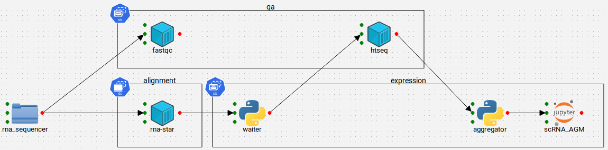
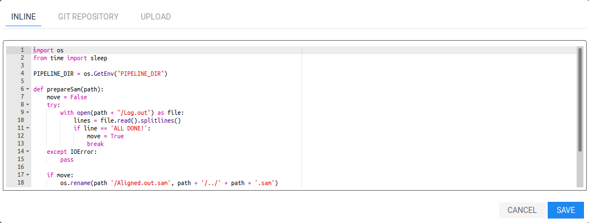
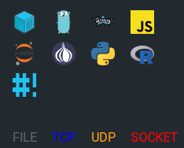
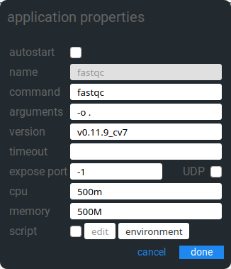
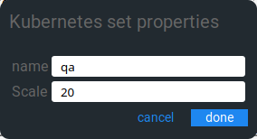
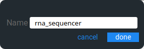

# Tiyo


Tiyo is a pipeline and infrastructure application written in GO with a graphical drag-drop interface using JointJS,
UIKit and JQuery.

> ### Warning: Pre-alpha product.
>
> Tiyo is still very much in the process of being born.
>
> If you are looking for an application that works "out of the box", then Tiyo is not yet the application for you.
> At present, Tiyo is a partial interface to a pre-existing cluster and a long wishlist of features.
> It is not complete and should not be considered as such.
>
> Tiyo will be considered production ready when this banner disappears.

The primary driver for creating this application is to serve as an easy to use tool for processing raw sequencing data
with a long term goal of providing a one-click interface for deploying an entire cluster, running a pipeline and
returning the processed data.

Tiyo started its life as a fork of [boltbrowserweb](https://github.com/evnix/boltdbweb/) and was subsequently heavily
rewritten to provide API services for integration, originally only with a file event notification system using
[notify](https://github.com/rjeczalik/notify) although later this expanded to include a Pipeline builder with drag-drop
functionality based on [JointJS](https://www.jointjs.com/opensource).

Out of the box, Tiyo is expected to support a number of different languages, each of which will run in a single docker
container inside a Kubernetes stack. This is the equivalent of an AWS Lambda executor or "serverless" application.



To support this, Tiyo uses [ACE](https://ace.c9.io/) to provide an inline editor for your code. Alongside this. Tiyo
supports a number of pre-built containers, which when running as a bio-informatics platform, come from
[Biocontainers](https://biocontainers.pro/).

## Container languages


The principle languages integrated into Tiyo are:

- Dockerfile
- Golang
- Groovy
- Javascript
- Perl
- Python
- R
- Shell/Bash

Additionally, Jupyter notebooks can be served and there are plans to integrate Jupyter into the app itself.

Communication between the apps is via one of 4 methods:

- File
- TCP
- UDP
- SOCKET

Right click on any element or link to set properties against it.

Application container properties            | Set properties                      | Source properties
:------------------------------------------:|:-----------------------------------:|:------------------------------------:
 |  | 

Any options not available on the given type will be greyed out/disabled, for example script on a pre-built container
or `watch` events on a socket.

## Future support

Longer term plans may see Tiyo integrate with Terraform/Ansible to provide direct deployment of any cloud native
application in the cloud of your choice.

## Container execution
Tiyo wraps itself into each docker container where it runs in `execute` mode. Here it will poll the server for tasks
assigned to it and execute the task as appropriate.

The exception to this is for custom docker containers which do not get the Tiyo application by default. If you wish to
include Tiyo as a listener inside your container, include the following code as part of your container build:

```
RUN mkdir /tiyo
WORKDIR /tiyo
COPY tiyo /usr/bin/tiyo
COPY config.json .
CMD ["/usr/bin/tiyo", "syphon", "-p", "%s"]
```

Initially, any elements with file inputs/outputs will be created as a single
[StatefulSet](https://kubernetes.io/docs/concepts/workloads/controllers/statefulset/) whilst any elements with pure
TCP/UDP connections will be created as a [Deployment](https://kubernetes.io/docs/concepts/workloads/controllers/deployment/)

Scope is also being developed to allow for [DaemonSet](https://kubernetes.io/docs/concepts/workloads/controllers/daemonset/)
integration. In future, there may be the option to choose between how you wish your containers to be deployed.

## Commands
Tiyo may be executed in one of 4 separate modes from the same binary

- `assemble` Runs the web interface for building (assembling) your pipeline. API listening on default port 8180
- `fill` Listens for file events and loads the file names - writes to assemble
- `flow` Builds the containers and prepares the instruction-set for execution. Backend API listening on default port 8280
  reads from / writes to Assemble
- `syphon` Executes the instruction set inside a container
  Reads from Flow

## Storage
Each pipeline is stored inside a BoltDB in base64 encoded JSON format. This format is a direct representation of the
JointJS JSON structure created from `graph.toJSON()`.

Any number of pipelines may be created and the chart is auto-saved in the background once a minute as soon as the
pipeline is given a title and elements have been added.

Additionally, the chart is saved each time properties are added to/altered on any element or link.

At present, there is no way to delete a pipeline via the GUI although it is possible to delete a pipeline by executing
a HTTP DELETE request using the [API](docs/api.md).

## Installation

> Note:
> To support the widest number of runtime containers, this application needs to be compiled with `CGO_ENABLED=0`
>
> This forces the net library to use go native commands rather than branching out into dynamically linked `C` libraries.
> Testing shows binaries compiled without using this flag fail on Alpine. There may be others.
>
> If your container refuses to start with `binary not found`, either look for an alternate container, or compile with
> this flag as appropriate. The make file includes this flag by default.

### Build / local installation
```
make && make install
```

### Server installation
Copy the tiyo binary to the assemble servers `/usr/local/bin` directory and create a new `tiyo.json` configuration file
in `/etc/tiyo` using the sample provided.

